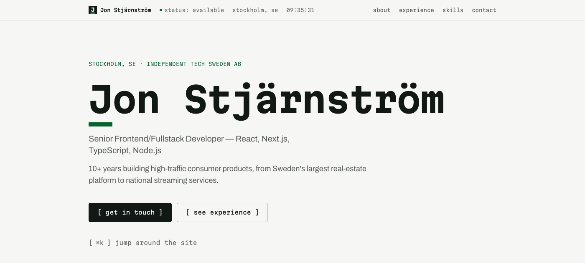

# Jon Stjärnström — Portfolio

Personal portfolio and consulting site for Jon Stjärnström, a senior frontend/fullstack developer. Live at **[jonstjarnstrom.se](https://jonstjarnstrom.se)**.



Built with the stack it's promoting — the source is public on purpose, as part of the pitch.

## Stack

- [Next.js](https://nextjs.org) (App Router) + [TypeScript](https://www.typescriptlang.org)
- [Tailwind CSS v4](https://tailwindcss.com) — CSS-first config, no `tailwind.config.ts`
- [Familjen Grotesk](https://fonts.google.com/specimen/Familjen+Grotesk) for display + [Archivo](https://fonts.google.com/specimen/Archivo) for body, on a fixed colour-blocked palette
- [GSAP](https://gsap.com) for the motion layer (ScrollTrigger, SplitText, Draggable + InertiaPlugin), wired through [`@gsap/react`](https://gsap.com/resources/React/) — see [Motion layer](#motion-layer)
- [cmdk](https://cmdk.paco.me) for the ⌘K command palette
- [Vercel AI SDK](https://ai-sdk.dev) with [Claude Haiku](https://www.anthropic.com) for the Ask panel, and [BotID](https://vercel.com/docs/botid) on the chat endpoint
- [Vitest](https://vitest.dev) for unit tests, [Playwright](https://playwright.dev) + [axe-core](https://github.com/dequelabs/axe-core) for e2e and accessibility testing
- Deployed on [Vercel](https://vercel.com), with [Vercel Web Analytics](https://vercel.com/analytics)

## Notable bits

- **⌘K command palette** — jump to any section, or ask `whoami`, `stack`, or `contact`
- **Ask panel** — a grounded AI chat in the ⌘K palette (Vercel AI SDK, streaming, one contact-card tool); answers only from the site's content, with per-IP rate limiting and a capped output budget
- **Contact sign-off** — a GSAP-driven closing sequence; static and unanimated under `prefers-reduced-motion`
- **Accessibility-first** — WCAG 2.1 AA, checked continuously with automated `axe` scans plus manual keyboard-only and reduced-motion passes, not bolted on at the end
- **No hand-authored images** — the Open Graph image is generated from code (`next/og`); the favicon and Apple touch icon are rasterised from an SVG "JS" lockup by `scripts/generate-icons.mjs` (via `sharp`). Nothing is a hand-drawn or uploaded asset.
- Respects `prefers-reduced-motion` throughout, including every scroll-reveal and hover interaction

## Development

```bash
pnpm install
pnpm dev                    # start the dev server at localhost:3000
pnpm build                  # production build
pnpm lint                   # eslint
pnpm test                   # unit tests (Vitest)
pnpm exec playwright test   # e2e, accessibility, and reduced-motion tests
```

### The Ask panel

`/api/chat` calls Claude Haiku 4.5 via the Vercel AI SDK's Anthropic
provider. Set `ANTHROPIC_API_KEY` (see `.env.example`) locally and in the
Vercel project. Unit tests mock the model and e2e tests stub the route, so
neither needs a key.

## Motion layer

GSAP drives every animation on the site. Plugins are registered once in
`lib/gsap.ts`; `GsapBootstrap` (mounted in the root layout) calls that on
the client and refreshes ScrollTrigger after `next/font` swaps the display
fonts.

- **`lib/gsap.ts`**
  - `registerGsap()` — idempotent, HMR-safe registration of `useGSAP`,
    ScrollTrigger, SplitText, Draggable, and InertiaPlugin.
  - `prefersReducedMotion()` plus the `REDUCED` / `NO_PREFERENCE`
    media-query constants.
  - `useReveal(ref, opts?)` — hook that reveals `[data-reveal]` descendants
    in sequence as their container scrolls into view (replaces the old
    reveal wrappers).
- **`components/motion/`**
  - `KineticName` — settles the hero name's characters in on load (SplitText).
  - `MagneticButton` — pulls its child toward the pointer; fine-pointer only.
  - `ScrollMarquee` — full-bleed ticker; scroll velocity scales and flips it.
  - `ShardField` — decorative squares: idle drift, pointer parallax, and
    draggable/inertia (Draggable + InertiaPlugin).
  - `ProjectsReel` — horizontal draggable card reel for 2+ projects; CSS
    scroll-snap is the no-JS / reduced-motion fallback.
- **`components/contact/ContactMark.tsx`** — the closing "JS" shatter:
  a triggered (not scrubbed) scale/rotate-in with a shard burst, reversed
  on scroll back up.

### Reduced motion

Every effect wraps its GSAP work in `gsap.matchMedia()`. The reduce branch
sets the final visual state directly and creates no ScrollTrigger,
SplitText, or Draggable instances, so `prefers-reduced-motion` users get the
finished layout with zero animation. Enforced by
`tests/e2e/reduced-motion.spec.ts`.

### Verifying motion

Verify GSAP motion with Playwright headless — the browser MCP tab throttles
`requestAnimationFrame` and shows animations frozen.

## Project structure

- `content/` — all copy and data, hardcoded and typed (no CMS)
- `components/sections/` — the page's sections (Hero, About, Experience, Skills, Contact)
- `components/motion/` — reusable animation primitives
- `components/command-palette/` — the ⌘K command palette
- `tests/e2e/` — Playwright smoke, accessibility, and reduced-motion tests
- `plan.md` / `tasks.md` — the running design and build log for this project, phase by phase
